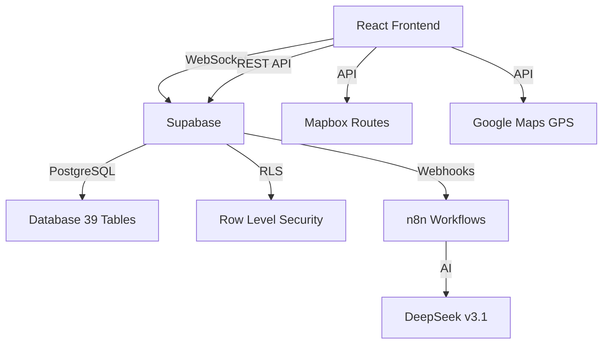

<div align="center">

<!-- Dynamic Header with Wave Animation -->


<!-- Animated Coding GIF -->


<!-- Dynamic Typing Animation -->
[](https://git.io/typing-svg)

<!-- Metrics Badges -->
<p align="center">
  
  
  
  
  
</p>

</div>

<!-- Divider -->


<br>

##  **Who Am I?**


```typescript
const camilo: Developer = {
  location: "🇨🇴 Colombia",
  title: "Full-Stack Developer & Enterprise Architect",
  company: "Open to Opportunities",
  experience: "3+ years",
  
  expertise: {
    backend: ["Node.js", "Express", "PostgreSQL", "Supabase"],
    frontend: ["React", "TypeScript", "TailwindCSS", "Vite"],
    realTime: ["WebSockets", "GPS Tracking", "Live Updates"],
    devops: ["Docker", "CI/CD", "GitHub Actions", "Nginx"],
    ai: ["n8n", "DeepSeek", "OpenRouter", "Automation"]
  },
  
  specialization: [
    "🚛 Fleet Management Systems (1000+ vehicles)",
    "🏗️ Enterprise Backend Architecture",
    "📡 Real-Time Data Processing",
    "🗺️ Geolocation & Route Optimization",
    "🔐 Security & RBAC Systems",
    "💾 Complex Database Design (39+ tables)",
    "🤖 AI Integration & Automation",
    "⚡ High-Performance APIs"
  ],
  
  currentFocus: [
    "☁️ Cloud Infrastructure (AWS, Azure, GCP)",
    "🧠 Machine Learning & MLOps",
    "🐳 Kubernetes & Container Orchestration",
    "🔗 Blockchain & Web3"
  ],
  
  funFact: "I build systems that track 1000+ vehicles in real-time! 🚗💨"
};
```

### 💡 **What Makes Me Different**

<table>
<tr>
<td width="50%" valign="top">

**🎯 Technical Excellence**
- ✅ Write clean, maintainable code
- ✅ 85%+ test coverage standard
- ✅ Performance-first mindset
- ✅ Security-aware development

</td>
<td width="50%" valign="top">

**🤝 Collaboration & Communication**
- ✅ Fluent in English & Spanish
- ✅ Clear technical documentation
- ✅ Agile/Scrum methodologies
- ✅ Open to mentorship

</td>
</tr>
</table>

<br clear="right"/>

<!-- Divider -->


<br>

##  **Tech Arsenal**

<div align="center">

### 🎨 **Frontend Development**


### ⚙️ **Backend Development**


### 🗄️ **Database & Backend Services**


### 🐳 **DevOps & Cloud**


### 🗺️ **APIs & Integrations**


</div>

<!-- Divider -->


<br>

##  **Featured Projects**

<div align="center">

### 🌟 **FLAGSHIP PROJECT** 🌟

</div>

<table>
<tr>
<td width="50%" valign="top">

### 🚛 **FlotaVehicular v2.0.0**

**Enterprise Fleet Management Platform**

[](https://github.com/CamiloTriana75/FlotaVehicular)


**🎯 Highlights:**
- 📡 Real-time GPS tracking (1000+ vehicles)
- 💾 39 normalized PostgreSQL tables
- 🔐 10-tier RBAC system
- 🤖 AI-powered chatbot (DeepSeek)
- 🗺️ Route optimization (Mapbox)
- ⚡ 30-second KPI updates
- 📊 10+ reporting templates

**🛠️ Tech Stack:**
`React 18` `TypeScript 5.5` `Supabase` `PostgreSQL` `TailwindCSS` `Vite` `Google Maps` `Mapbox` `n8n` `WebSockets`

</td>
<td width="50%" valign="top">

<br>

**📊 System Architecture**



**📈 Key Features:**

- ✅ **Real-Time Monitoring**: Live GPS tracking
- ✅ **Smart Alerts**: 5 types, 4 severity levels
- ✅ **Maintenance**: Preventive & corrective
- ✅ **Analytics**: Custom reports & KPIs
- ✅ **Geofencing**: Circular & polygon zones
- ✅ **Driver Management**: License validation
- ✅ **Incident Reporting**: Real-time tracking
- ✅ **85%+ Test Coverage**

<details>
<summary>📚 <b>View Complete Documentation</b></summary>

<br>

| Document | Description |
|----------|-------------|
| 🏗️ **ARQUITECTURA.md** | Complete system architecture |
| 💾 **DB_MODELO_FISICO.md** | ER diagram + 39 table specs |
| 📋 **CASOS_USO_DETALLADOS.md** | 18+ detailed use cases |
| 🚀 **GUIA_INICIO_RAPIDO.md** | Quick start guide |
| 🧪 **TESTING-E2E.md** | E2E testing guide |

</details>

</td>
</tr>
</table>

---

### 🎯 **Other Notable Projects**

<table>
<tr>
<td width="33%" valign="top">

#### ⚽ **ProyectoElden**
*Sports Field Booking Platform*

[](https://github.com/camilotriana/ProyectoElden)

**Stack:**
`React` `Firebase` `TailwindCSS` `Stripe`

**Features:**
- 📅 Real-time booking system
- 💳 Payment processing
- 📊 Analytics dashboard
- 🔔 Push notifications

</td>
<td width="33%" valign="top">

#### 💼 **Nómina Empleados**
*Payroll Management System*

[](https://github.com/camilotriana/Nomina-Empleados-NetBeans)

**Stack:**
`Java` `Swing` `MySQL` `JDBC`

**Features:**
- 💰 Automatic salary calculations
- 📄 Tax computation
- 📊 Report generation
- 👥 Employee management

</td>
<td width="33%" valign="top">

#### 🔢 **Series Calculator**
*Taylor & McLaurin Series*

[](https://github.com/camilotriana/Pagina-web-calcular-series-de-taylor-y-Mclaurin)

**Stack:**
`React` `Math.js` `D3.js` `Chart.js`

**Features:**
- 📐 Series computation
- 📈 Interactive visualizations
- 🎓 Educational tool
- ⚡ Real-time calculations

</td>
</tr>
</table>

<!-- Divider -->


<br>

##  **GitHub Analytics**

<div align="center">


<br><br>


### 📊 **Contribution Activity**


### 🏆 **GitHub Trophies**


</div>

<!-- Divider -->


<br>

## 📊 **Coding Activity**

<div align="center">

### **💻 Tech Stack Usage**

```text
TypeScript   ████████████████░░░░░░░░  65%  │ Enterprise Apps & APIs
JavaScript   ██████████░░░░░░░░░░░░░░  40%  │ Frontend & Automation
React        ████████████░░░░░░░░░░░░  50%  │ UI Components & SPA
PostgreSQL   ████████░░░░░░░░░░░░░░░░  35%  │ Database Architecture
Python       ██████░░░░░░░░░░░░░░░░░░  25%  │ Scripts & ML
Node.js      ██████████░░░░░░░░░░░░░░  42%  │ Backend Services
```

### **🎯 Development Stats**

<table>
<tr>
<td align="center" width="25%">
<br>
<b>🚀 Production</b><br>
<sub>3+ Systems</sub>
</td>
<td align="center" width="25%">
<br>
<b>💻 Commits</b><br>
<sub>2000+</sub>
</td>
<td align="center" width="25%">
<br>
<b>🔧 Technologies</b><br>
<sub>15+ Stack</sub>
</td>
<td align="center" width="25%">
<br>
<b>⭐ Stars</b><br>
<sub>Growing</sub>
</td>
</tr>
</table>

</div>

<!-- Divider -->


<br>

## 🤝 **Connect With Me**

<div align="center">

<a href="https://camilotriana.netlify.app/" target="_blank">

</a>
<a href="https://github.com/CamiloTriana75" target="_blank">

</a>
<a href="https://www.linkedin.com/in/camilo-triana-868814238/" target="_blank">

</a>
<a href="mailto:jtriaha@gmail.com" target="_blank">

</a>

<br><br>

**💼 Open For Opportunities:**


</div>

<!-- Divider -->


<div align="center">

### 🐍 **Contribution Snake**

<picture>
  <source media="(prefers-color-scheme: dark)" srcset="https://raw.githubusercontent.com/CamiloTriana75/CamiloTriana75/output/github-contribution-grid-snake-dark.svg">
  <source media="(prefers-color-scheme: light)" srcset="https://raw.githubusercontent.com/CamiloTriana75/CamiloTriana75/output/github-contribution-grid-snake.svg">
  
</picture>

<sub>🔄 *Animated snake showing my GitHub contributions*</sub>

---

### 💡 **Random Dev Quote**


---

### 🎵 **Currently Listening**

<a href="https://open.spotify.com/user/Juanamilotriana">
  
</a>

<sub>🎧 *Real-time music stats powered by Spotify*</sub>

---

<!-- Footer Wave -->


### ⭐ **Show Your Support**

**If you find my work interesting, please consider:**
- ⭐ Starring my repositories
- 🤝 Connecting on LinkedIn
- 💼 Reaching out for collaboration

<br>


<br>

*Last updated: February 10, 2026 | Made with 💙 & ☕ by Camilo Triana*

</div>
